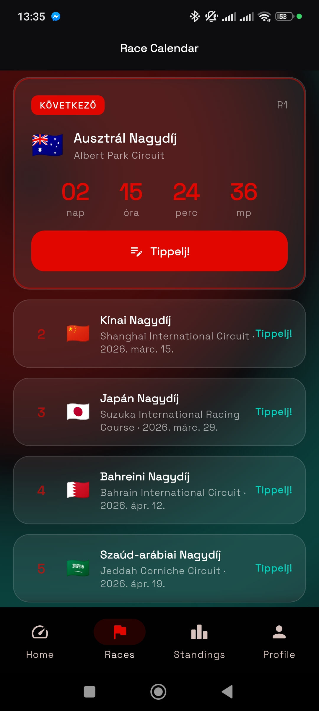
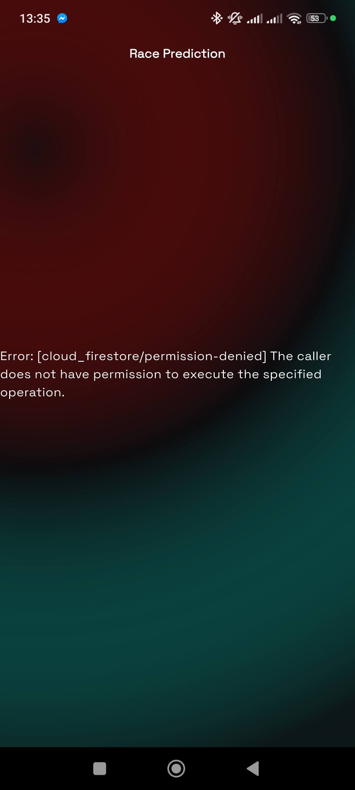
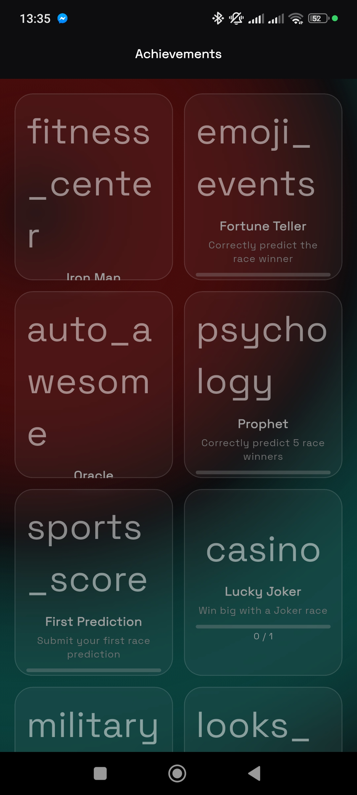

# 🏎️ F1 Tipp Mix — Formula 1 Prediction Game

<p align="center">
  
</p>

<p align="center">
  <strong>Predict race results, collect points, compete with friends — and experience every thrill of the F1 season!</strong>
</p>

<p align="center">
  <a href="https://f1.liggin.xyz">🌐 Website</a> &nbsp;·&nbsp;
  <a href="https://f1.liggin.xyz/releases/f1tippmix.apk">📥 Download APK</a>
</p>

---

## 📱 What is F1 Tipp Mix?

F1 Tipp Mix is a **Flutter-based mobile tipping game** for Formula 1 fans. Predict the podium, pole position, and fastest lap for every Grand Prix — then see how you stack up against friends, groups, and even an AI opponent.

Built with a **Python backend**, **Firebase** (Auth, Firestore, FCM), and a custom file server — all self-hosted on a VPS.

## ✨ Features

| Feature | Description |
|---------|-------------|
| 🏆 **Race Predictions** | Predict P1–P3, pole position, fastest lap for every GP |
| 📅 **Season Predictions** | Pick your World Champion and Constructor before the season starts |
| 🃏 **Joker System** | Use a joker on your favorite race for double points |
| 🔥 **Streak Bonuses** | Earn bonus points for consecutive race predictions |
| 👥 **Friend Groups** | Create groups, invite friends with a unique 6-character FriendCode |
| 📊 **Dual Leaderboard** | Global rankings (Human / AI / All) + Group leaderboards |
| 🤖 **FormaAI** | AI opponent that predicts every race — can you beat it? |
| 🏅 **Achievements** | Unlock badges for milestones (100 pts, 5-race streak, perfect podium, etc.) |
| 🏎️ **Live Race** | Real-time driver positions during race sessions |
| 🔔 **Push Notifications** | Race reminders, result alerts, streak warnings via FCM |
| 🌙 **Dark Theme** | Eye-friendly, modern F1-inspired design |
| 🌍 **Localization** | Hungarian & English |
| ❤️ **Donation Support** | Revolut & Bitcoin options in-app |

## 🖼️ Screenshots

<p align="center">
  &nbsp;
  &nbsp;
  
</p>

## 🏗️ Architecture

```
forma1_tipp_mix/
├── mobile/          # Flutter app (Dart)
│   ├── lib/src/
│   │   ├── core/        # Theme, routing, services, utils
│   │   └── features/    # Feature-based architecture
│   │       ├── auth/        # Firebase Auth + registration
│   │       ├── home/        # Dashboard, countdown, quick actions
│   │       ├── race/        # Predictions, calendar, results
│   │       ├── profile/     # User profile, avatar upload
│   │       ├── gamification/# Achievements, bonus rounds
│   │       ├── standings/   # Leaderboards (global + groups)
│   │       ├── groups/      # Friend groups, invites
│   │       └── live_race/   # Real-time race positions
│   └── android/     # Android platform config
│
├── server/          # Python backend (self-hosted VPS)
│   ├── main.py              # Entry point, service orchestrator
│   ├── file_server.py       # Avatar uploads, APK serving
│   ├── race_result_worker.py# Result fetching, scoring, achievements
│   ├── notification_service.py # FCM push notifications
│   ├── live_race_relay.py   # Real-time race data relay
│   ├── config.py            # Constants, scoring rules
│   └── landing/             # Website (f1.liggin.xyz)
│
└── version.json     # App version & release notes
```

## 🛠️ Tech Stack

**Mobile:**
- [Flutter](https://flutter.dev/) 3.x + Dart
- [Riverpod](https://riverpod.dev/) — State management
- [Firebase](https://firebase.google.com/) — Auth, Firestore, Cloud Messaging
- [GoRouter](https://pub.dev/packages/go_router) — Navigation
- [CachedNetworkImage](https://pub.dev/packages/cached_network_image) — Image caching
- [flutter_animate](https://pub.dev/packages/flutter_animate) — Animations

**Server:**
- Python 3.11+
- Firebase Admin SDK
- Custom HTTP file server (multipart avatar upload)
- Nginx reverse proxy + Let's Encrypt SSL
- systemd service management

## 🚀 Getting Started

### Prerequisites
- Flutter SDK 3.x
- Android SDK
- Python 3.11+
- Firebase project with Firestore, Auth, FCM enabled

### Mobile App
```bash
cd mobile
flutter pub get
flutter run
```

### Server
```bash
cd server
pip install -r requirements.txt
python main.py --all
```

## 📦 Current Version

**v2.5.0** (build 11) — March 2026

- Avatar upload fix (multipart parsing + cache refresh)
- Achievement system fix (correct IDs server ↔ client)
- Standings fix (all users appear correctly)
- Season tip animation (pulsing indicator)
- FCM notifications (race reminders + result push)
- SSL configured for af1.liggin.xyz
- Landing page: donation section + GitHub link

## 💖 Support

If you enjoy the app, consider supporting the development!

- **Revolut:** `@szabolt19q` → [revolut.me/szabolt19q](https://revolut.me/szabolt19q)
- **Bitcoin:** `bc1qeycda4kdd8kupgh9mrxxgardkrkjh82wpurh8c`

## 📄 License

This project is open source. Feel free to explore, learn, and contribute!

---

<p align="center">
  Made with ❤️ and way too much coffee ☕ during F1 weekends
</p>